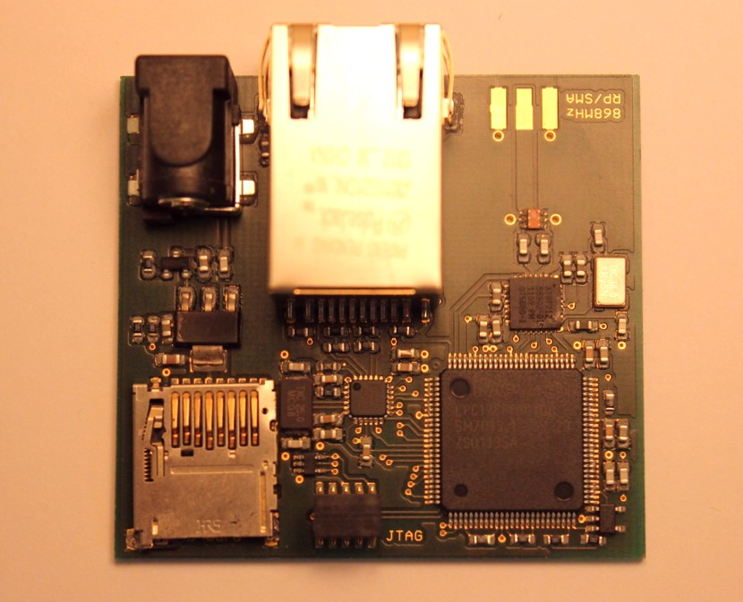

EAGLE CAD Design files for the VLF Gateway Unit

## Photo

## Design Notes

The board is based around a NXP
[LPC1766](http://www.nxp.com/documents/data_sheet/LPC1769_68_67_66_65_64_63.pdf)
ARM Cortex-M3 microcontroller. A good proportion of the board area is
given over to the ethernet PHY (an
[SMSC8720](http://www.smsc.com/media/Downloads_Public/Data_Sheets/8720a.pdf))
and conntector. A small EEPROM that comes pre-programmed with a
globally unique ethernet MAC address is also included.

Data is received from the remote unit using an
[AT86RF212](http://www.atmel.com/images/doc8168.pdf) 868MHz radio and
stored on a micro SD card.

## [License](LICENSE.md)

[MIT](http://opensource.org/licenses/MIT)
